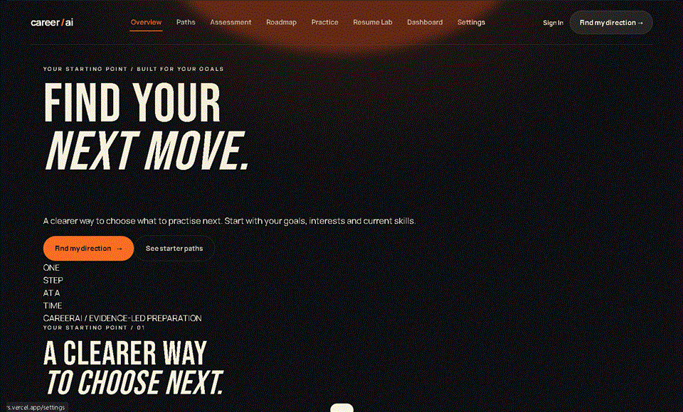
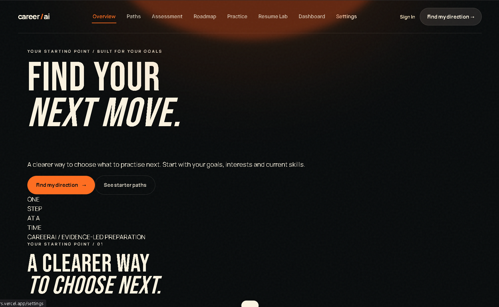
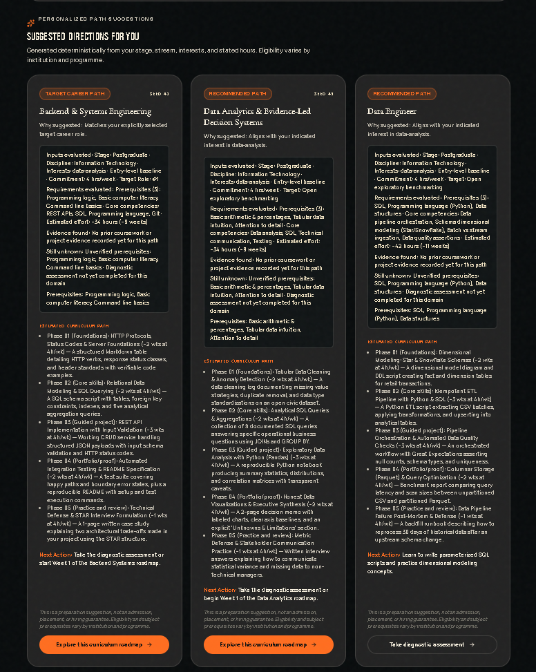
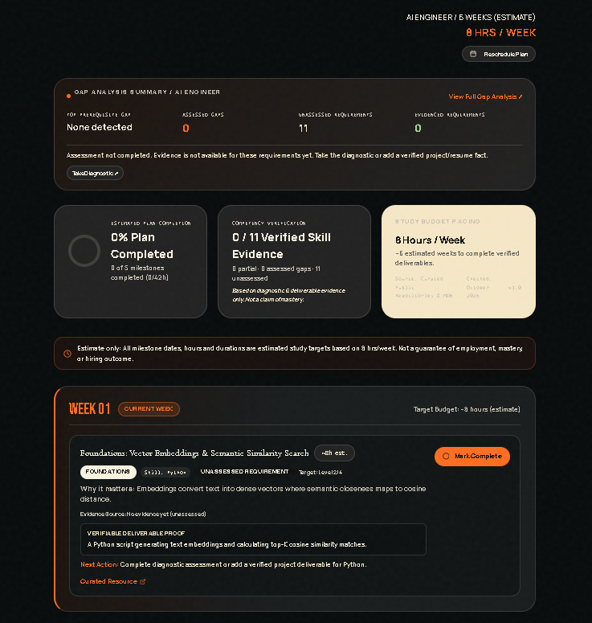
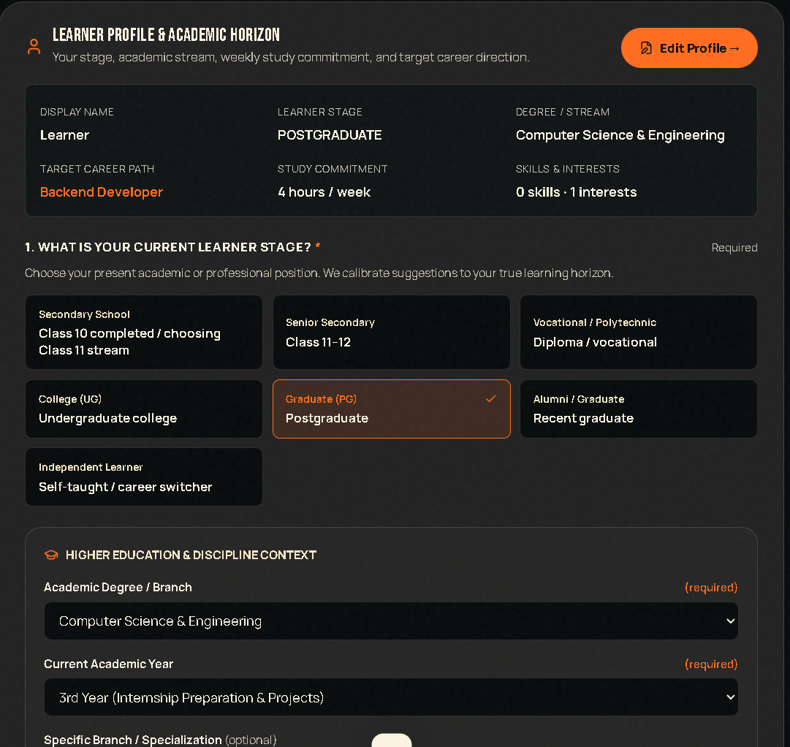
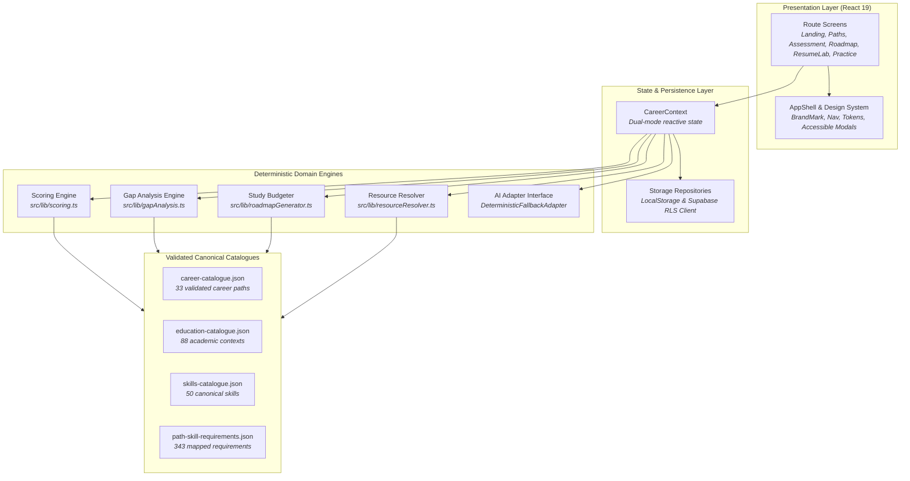

<div align="center">


# CareerAI

### *From wondering what to prepare next to taking one clear, evidence-based step.*

A transparent, student-first career preparation platform designed to help learners understand their starting point, explore 33 career paths, identify real skill gaps, and follow a realistic, time-budgeted roadmap—without exaggerated claims or invented credentials.

<br />

[](https://github.com/meoxx009/career-AI/actions/workflows/ci.yml)
[](https://github.com/meoxx009/career-AI/tree/main/src/test)
[](https://react.dev/)
[](https://www.typescriptlang.org/)
[](https://vite.dev/)
[](https://github.com/meoxx009/career-AI/blob/main/src/styles/tokens.css)
[](https://career-ai-trevors.vercel.app)

<br />

<p align="center">
  <a href="https://career-ai-trevors.vercel.app"><b>🚀 Explore Live Demo</b></a> &nbsp;•&nbsp;
  <a href="#-quick-start"><b>⚡ Quick Start</b></a> &nbsp;•&nbsp;
  <a href="#-product-walkthrough"><b>🗺️ How It Works</b></a> &nbsp;•&nbsp;
  <a href="#-core-feature-showcase"><b>✨ Feature Highlights</b></a> &nbsp;•&nbsp;
  <a href="#-trust-safety--integrity-contract"><b>🛡️ Trust & Safety</b></a>
</p>

<br />

<!-- Animated Product Preview -->
<a href="https://career-ai-trevors.vercel.app">
  
</a>

<p align="center">
  <sub><b>Interactive Walkthrough:</b> Direction Discovery → Academic Horizon Intake → Deterministic Path Recommendations → Weekly Milestone Roadmap</sub>
</p>

</div>

---

## 💡 Why CareerAI?

> *"Students do not always need more tabs. They need a clearer next move."*

When students and early-career learners prepare for internships or technical jobs, they frequently get trapped in an endless cycle of conflicting advice, uncalibrated tests, and bloated curricula. Most career platforms either sell false placement guarantees or encourage students to inflate their resumes with unverified metrics.

**CareerAI provides an honest, evidence-grounded alternative:**

| The Traditional Preparation Struggle | The CareerAI Evidence-Led Approach |
| :--- | :--- |
| **Unclear Direction:** Jumping randomly between viral roadmaps and trending languages without context. | **Explainable Matching:** Calibrated recommendations across 33 career paths based on your academic stage, discipline context, and interests. |
| **Pessimistic Scoring:** Unanswered questions or unassessed skills penalized as 0% ability. | **Transparent Uncertainty:** `null` strictly means *Not assessed yet*. We never penalize what hasn't been evaluated. |
| **Unrealistic Timelines:** Monolithic 500-hour lists that cause burnout and abandonment. | **Continuous-Pointer Budgeting:** Weekly milestones sized to your actual available study hours (1–40 hrs/wk) with prerequisite locking. |
| **Hallucinated Resumes:** AI writing tools inventing fake "10x latency reductions" and corporate metrics. | **Verifiable Fact Grounding:** Honest resume rewrites anchored strictly to your verified project evidence and actual deliverables. |
| **High-Pressure Interviews:** Intimidating video recording without concrete criteria or feedback. | **Text-First Practice Room:** Low-friction, rubric-scored STAR answers with targeted recommendations for immediate iteration. |

---

## 🗺️ How CareerAI Works

CareerAI guides learners along an explainable 5-step loop designed to convert ambiguity into measurable weekly progress:

```mermaid
flowchart LR
    A[1. Context & Intake<br/><i>Stage, stream & budget</i>] --> B[2. Diagnostic Assessment<br/><i>18 focused tracks</i>]
    B --> C[3. 33 Career Directions<br/><i>Objective alignment</i>]
    C --> D[4. Skill Gap Breakdown<br/><i>Verified vs. unassessed</i>]
    D --> E[5. Milestone Roadmap<br/><i>Curated resources & locks</i>]
    E --> F[6. Proof & Practice<br/><i>Resume Lab & STAR room</i>]
    F --> G([One Clearer<br/>Next Step])

    style A fill:#17191e,stroke:#FF6D1F,stroke-width:1px,color:#FAF3E1
    style B fill:#17191e,stroke:#FF6D1F,stroke-width:1px,color:#FAF3E1
    style C fill:#17191e,stroke:#FF6D1F,stroke-width:1px,color:#FAF3E1
    style D fill:#17191e,stroke:#FF6D1F,stroke-width:1px,color:#FAF3E1
    style E fill:#17191e,stroke:#FF6D1F,stroke-width:1px,color:#FAF3E1
    style F fill:#17191e,stroke:#FF6D1F,stroke-width:1px,color:#FAF3E1
    style G fill:#FF6D1F,stroke:#FF6D1F,stroke-width:2px,color:#0d0e12
```



1. **Intake & Academic Horizon**: Select your learner stage (Secondary School, Senior Secondary, Polytechnic Diploma, College UG, Postgraduate, or Self-Taught), choose your discipline context from 88 curated academic tracks, and set your weekly study budget.
2. **Untimed Skill Diagnostic**: Answer structured conceptual questions across 18 specialized technical tracks. Every question includes a concept rationale drawer explaining *why* the question matters.
3. **Compare Direction Alignment**: Our deterministic recommendation engine evaluates academic bridges, interest overlaps, and verified competencies across 33 career paths—free from college prestige or demographic bias.
4. **Follow a Paced Roadmap**: Tasks are scheduled into sequential weeks based on your study capacity. Dependent tasks remain locked until prerequisite deliverables are verified.
5. **Curated Authoritative Resources**: Every single milestone connects to verified, official external technical documentation (Hugging Face, MDN, PostgreSQL, PyTorch, Scikit-learn, W3C WAI, Docker, AWS) rather than generic search queries or dead links.
6. **Practise with Proof**: Craft verifiable resume bullets in the Resume Lab and rehearse interview answers in the Practice Room against industry rubrics.

---

## 📸 Product Preview

<div align="center">

### 1. Landing & Direction Discovery
*A calm, high-contrast editorial aesthetic built on a near-black canvas with warm linen surfaces and electric tangerine highlights.*



<br /><br />

### 2. Personalized Path Recommendations
*Transparent matching rationale detailing evaluated inputs, detected evidence, and remaining unknown competencies.*



<br /><br />

### 3. Weekly Roadmap & Gap Summary
*Dual-progress separation: distinct tracking for Estimated Plan Completion vs. Verified Skill Evidence.*



<br /><br />

### 4. Comprehensive Learner Context Intake
*Inclusive multi-stage intake supporting school students, degree holders, and self-taught career switchers alike.*



</div>

---

## ✨ Core Feature Showcase

### 🎯 1. Adaptive Diagnostic Assessment
- **18 Specialized Tracks**: Frontend, Backend, Full Stack, Systems/Embedded, Data Engineering, Machine Learning, AI Engineering, RAG Systems, DevOps, Cybersecurity, QA Automation, UI/UX Design, and Product Management.
- **Accessible Untimed Mode**: Stress-free evaluation with instant concept explanations.
- **Strict Uncertainty Contract**: Unanswered questions stay `null` (*Not assessed*), guaranteeing that unassessed skills are never falsely treated as confirmed deficiencies.

### 🧭 2. 33-Role Unified Career Catalogue & Path Builder
- **Curated Career Paths**: Across three primary domains: *Software & Engineering*, *Data & AI*, and *Design & Product*.
- **88 Academic Context Profiles**: Tailored educational pathways for CS/IT, Core Engineering, Science, Commerce, and Self-Taught learners.
- **343 Deterministic Skill Requirements**: Each career path defines explicit prerequisites, target proficiency levels (1–4), and verifiable evidence criteria.
- **Preserved Core Starter Roles**: Immediate access to foundational entry roles (Backend Developer, Frontend Developer, and Data Analyst).

### 🗺️ 3. Budgeted Milestone Roadmap Engine
- **Continuous-Pointer Study Scheduler**: Dynamic scheduling allocating 1 to 40 hours per week based on learner availability.
- **Prerequisite Locking**: Automatic dependency tracking ensuring foundational milestones precede advanced implementations.
- **165 Curated Learning Resources**: Direct external HTTPS links to official documentation (MDN, W3C, Hugging Face, Python Docs, PyTorch, Docker, Kubernetes, OWASP, etc.).
- **Data Healing on Read**: Stored roadmaps are verified and repaired automatically without modifying learner completion records.

### 📄 4. Truthful Resume Lab
- **Client-Side Document Parsing**: In-browser text extraction from PDF (`pdfjs-dist`), Word (`mammoth`), and image uploads (`tesseract.js`) without leaking files to third-party endpoints.
- **Fact-Anchored Suggestion Cards**: Accept, edit, or reject rewrite proposals derived strictly from verified project deliverables.
- **Zero-Hallucination Guardrail**: Prohibits the invention of corporate metrics, imaginary team sizes, or unverified claims.

### 🎙️ 5. Low-Friction Practice Room
- **Text-First STAR Framing**: Rehearse technical defense and behavioral questions with structured STAR (Situation, Task, Action, Result) templates.
- **Rubric-Scored Feedback**: Instant evaluations on clarity, specificity, and technical trade-offs with deterministic offline fallback.
- **Zero Camera Pressure**: Thoughtful practice designed for students who want to build competence before facing live interviewers.

### 🛡️ 6. Dual-Mode Persistence & Profile Management
- **Guest-First Local Storage**: Fully functional offline without requiring an account.
- **Optional Cloud Authentication**: Seamless Supabase Auth supporting Email/Password and Google OAuth sign-in.
- **Database Row-Level Security (RLS)**: User-owned data isolated with strict PostgreSQL RLS policies.
- **Professional Profile Section**: Customizable display name, handle, avatar upload (PNG/JPG/WEBP with client-side 2 MB validation), and accessible font-scale adjustments (14px–20px).

---

## 🛠️ Verified Technology Stack

Every library and dependency in CareerAI is intentionally chosen to support a lightweight, responsive, accessible, and privacy-conscious client-side application:

| Layer | Technology | Version | Purpose in Codebase |
| :--- | :--- | :--- | :--- |
| **Frontend Framework** | [React](https://react.dev/) | `^19.2.8` | Component lifecycle, hooks, context state management |
| **Language** | [TypeScript](https://www.typescriptlang.org/) | `~6.0.2` | Strict end-to-end type safety, compile-time contracts |
| **Bundler & Tooling** | [Vite](https://vite.dev/) | `^8.3.0` | Sub-second HMR dev server, optimized production build |
| **Routing** | [React Router](https://reactrouter.com/) | `^7.18.4` | Declarative client-side routing, route-level code splitting |
| **Schema Validation** | [Zod](https://zod.dev/) | `^4.6.5` | Runtime schema validation for data catalogues and AI output |
| **Form Handling** | [React Hook Form](https://react-hook-form.com/) | `^7.89.0` | Accessible, performant form state management |
| **UI Iconography** | [Lucide React](https://lucide.dev/) | `^1.49.0` | Accessible SVG icons with strict `aria-hidden` attributes |
| **File Extraction** | [Mammoth](https://github.com/mwilliamson/mammoth.js) | `^1.13.0` | Client-side `.docx` resume text extraction |
| **PDF Processing** | [PDF.js](https://mozilla.github.io/pdf.js/) | `^6.3.289` | Client-side `.pdf` resume text parsing |
| **Client-Side OCR** | [Tesseract.js](https://tesseract.projectnaptha.com/) | `^7.0.0` | Optical character recognition for scanned image resumes |
| **Backend & Auth** | [Supabase JS](https://supabase.com/) | `^2.117.2` | Optional cloud auth, RLS-backed remote persistence |
| **Test Suite** | [Vitest](https://vitest.dev/) | `^5.0.3` | Unit, integration, scoring, and UI component tests (363 tests) |
| **DOM Testing** | [Testing Library](https://testing-library.com/) | `^16.3.3` | React 19 testing with `@testing-library/jest-dom` & `jsdom` |
| **Design System** | CSS Design Tokens | Standard CSS3 | Bespoke custom properties in `src/styles/tokens.css` *(No Tailwind)* |

> [!NOTE]
> **Styling Implementation:** CareerAI uses a handcrafted, token-driven CSS architecture (`src/styles/tokens.css` and `src/index.css`) utilizing native CSS variables, flexbox, and CSS grid. It does not use or require Tailwind CSS.

---

## 🌐 Application Route Surface

Verified from [`src/App.tsx`](file:///c:/Users/ezyre/Documents/Career%20AI/src/App.tsx):

| Route | View Component | Description |
| :--- | :--- | :--- |
| `/` | `Landing.tsx` | Overview hero, design tokens, Rahul demo snapshot, 3 bento pillars |
| `/onboarding` | `Onboarding.tsx` | 3-step intake wizard: education, study hours, target aspirations |
| `/profile/edit` | `ProfileEdit.tsx` | Comprehensive learner profile, academic stream, and facts editor |
| `/assessment` | `Assessment.tsx` | 18-track skill diagnostic assessment with concept rationale drawer |
| `/paths` | `Paths.tsx` | Personalized direction recommendations with evaluated inputs |
| `/paths/builder` | `PathBuilder.tsx` | Complete 33-role unified career catalogue and path explorer |
| `/paths/:roleSlug` | `RoleDetail.tsx` | Dynamic role overview, competencies, and 5-phase staged curriculum |
| `/dashboard` | `Dashboard.tsx` | Learner progress dashboard, active target card, and next best action |
| `/roadmap` | `Roadmap.tsx` | Weekly milestone timeline, prerequisite locks, and curated resources |
| `/resume` | `ResumeLab.tsx` | Document extractor, verified fact list, and honest rewrite suggestions |
| `/practice` | `Practice.tsx` | Technical STAR mock interview simulator with rubric evaluations |
| `/settings` | `Settings.tsx` | Account management, 14–20px font-scale slider, and data purge |
| `/terms` | `LegalPage.tsx` | Transparent terms of service and service boundaries |
| `/privacy` | `LegalPage.tsx` | Privacy contract, zero-tracking policy, and local data disclosure |
| `/ai-safety` | `LegalPage.tsx` | AI safety principles, hallucination guards, and disclaimer policies |
| `/design-system` | `DesignSystemShowcase.tsx` | Interactive UI token catalog, buttons, badges, and layout primitives |

---

## ⚡ Quick Start

### Prerequisites
- **Node.js**: v20.x or higher
- **npm**: v10.x or higher

### 1. Clone the Repository
```bash
git clone https://github.com/meoxx009/career-AI.git
cd career-AI
```

### 2. Install Dependencies
```bash
npm install
```

### 3. Configure Local Environment (Optional)
CareerAI works **100% out-of-the-box in deterministic fallback mode** without any external API keys or third-party accounts.

If you wish to test optional Supabase cloud authentication and database synchronization:
```bash
cp .env.example .env
```
Populate client-safe keys in `.env` (never commit this file):
```env
VITE_SUPABASE_URL=https://your-project.supabase.co
VITE_SUPABASE_PUBLISHABLE_KEY=your-publishable-anon-key
```

### 4. Run Development Server
```bash
npm run dev
```
Open [http://localhost:5173](http://localhost:5173) in your browser.

---

## 🧪 Comprehensive Verification Suite

We maintain a strict quality bar across data integrity, TypeScript strictness, linting, and automated tests.

Run the entire verification pipeline in one command:
```bash
npm run check
```

Or run individual verification steps:

```bash
# 1. Validate data catalogues (CSV & JSON referential integrity)
npm run validate:data

# 2. Run static code analysis (ESLint)
npm run lint

# 3. Check TypeScript types (tsc --noEmit)
npm run typecheck

# 4. Run unit and integration tests (Vitest)
npm test

# 5. Build production bundle (TypeScript + Vite)
npm run build
```

---

## 🏛️ System Architecture

CareerAI follows a modular architecture that cleanly separates presentation, state management, pure deterministic domain engines, and storage repositories:



### Deterministic Offline Fallback
When no AI API key is configured (or when network requests fail), CareerAI seamlessly routes all role explanations, resume reviews, and interview feedback through the `DeterministicFallbackAdapter` in [`src/lib/ai-adapter.ts`](file:///c:/Users/ezyre/Documents/Career%20AI/src/lib/ai-adapter.ts). Learners always receive structured, rubric-accurate advice with zero latency and zero dependency on external services.

---

## 🛡️ Trust, Safety & Integrity Contract

From day one, CareerAI was engineered under strict ethical guidelines defined in [`docs/RULES.md`](file:///c:/Users/ezyre/Documents/Career%20AI/docs/RULES.md):

1. **No Hallucinated Credentials**: We never invent resume achievements, artificial percentage improvements, or fabricated employers. All suggestions are anchored to verifiable facts entered by the learner.
2. **No False Placement Guarantees**: CareerAI is a preparation aid, not a placement oracle. We do not predict placement odds, calculate salaries, or claim to guarantee hiring outcomes.
3. **Transparent Uncertainty**: If a skill has not been tested, its state is strictly `null` (*Not assessed*). We never convert the absence of evidence into a zero score or a "confirmed gap".
4. **Local-First Privacy**: Guest mode stores all data inside your browser's `localStorage`. No resume text, diagnostic answer, or interview transcript is sent to external servers unless you explicitly sign in to an authenticated account.
5. **No Discriminatory Bias**: Recommendations are derived strictly from academic bridges, stated interests, and verified skill levels—never by demographic background, college tier, or CGPA cutoffs.

---

## 🎨 Visual Identity & Design Tokens

CareerAI uses a bespoke luxury-editorial design language inspired by warm architectural documents and precision instruments:

<div align="center">

| Token Name | Hex Code | Visual Swatch | Role in Product |
| :--- | :--- | :--- | :--- |
| **Void** | `#0d0e12` |  | Deep, low-distraction dark background canvas |
| **Black Hole** | `#222222` |  | Elevated card surfaces, borders, and structured containers |
| **Linen** | `#FAF3E1` |  | High-contrast display headlines and focal typography |
| **Cotton** | `#F5E7C6` |  | Calibrated body text, data labels, and readable paragraphs |
| **Electric Tangerine** | `#FF6D1F` |  | Primary action triggers, active tabs, and progress glows |

</div>

- **Typography**: Condensed display titles paired with clean, accessible sans-serif body typography.
- **Accessibility**: Strict WCAG AA contrast compliance, minimum 44px touch targets, full keyboard `:focus-visible` rings, and a user-controlled 14px–20px root font-scaling preference.

---

## 📁 Repository Structure

```text
career-AI/
├── .github/
│   └── workflows/
│       └── ci.yml               # Automated CI pipeline (lint, test, build)
├── data/                        # Validated CSV & JSON seed catalogues
│   ├── academic-contexts.json   # 21 academic context definitions
│   ├── career-catalogue.json    # 33 career paths with 5-phase curricula
│   ├── education-catalogue.json # 88 degree and specialization profiles
│   ├── path-skill-requirements.json # 343 deterministic requirements
│   ├── skills-catalogue.json    # 50 canonical skills definitions
│   └── *.csv                    # Assessment, role, and template CSV datasets
├── docs/                        # Architectural, PRD, and design documentation
│   ├── assets/                  # Documentation media (careerai-demo.gif)
│   ├── screenshots/             # High-resolution real application captures
│   ├── ARCHITECTURE.md          # Boundaries, RLS, and data flows
│   ├── DESIGN.md                # Color palette and typography tokens
│   ├── MEMORY.md                # Engineering decisions and milestone log
│   ├── PRD.md                   # Product requirements and acceptance criteria
│   ├── RULES.md                 # Non-negotiable trust and security rules
│   └── TASKS.md                 # Completed and active task roadmap
├── public/                      # Static assets and favicon
├── scripts/                     # Data validation and catalog integrity scripts
│   └── validateCsv.mjs          # Comprehensive referential integrity validator
├── src/
│   ├── components/              # Shared UI components and primitives
│   ├── context/                 # CareerContext and state persistence
│   ├── data/                    # Data catalogue loaders and adapters
│   ├── lib/                     # Domain logic (scoring, gapAnalysis, roadmap)
│   │   ├── repositories/        # Dual-mode storage repositories (Local + Supabase)
│   │   ├── ai-adapter.ts        # AI adapter with deterministic fallback
│   │   └── resourceResolver.ts  # Curated external HTTPS resource registry
│   ├── pages/                   # Route-level application pages (15 routes)
│   ├── styles/                  # CSS tokens, theme variables, and global styles
│   └── test/                    # Comprehensive Vitest test suites (28 files)
├── package.json                 # Project dependencies and npm scripts
└── README.md                    # Product landing page & developer guide
```

---

## ⚠️ Synthetic Demo & Data Disclaimer

The public live demo and default seed state utilize **synthetic fictional learner data** (e.g., *"Rahul Sharma, B.Tech CSE"*). This data exists solely to illustrate realistic platform states, diagnostic scores, and roadmap pacing for review purposes. It does not represent any real student or actual individual.

CareerAI provides structured educational preparation support. It does not constitute formal accreditation, legal employment counsel, or an official placement outcome.

---

## 📚 Essential Documentation Index

- **[Product Requirements Document (PRD)](docs/PRD.md)** — Scope, acceptance criteria, and scoring contracts.
- **[System Architecture](docs/ARCHITECTURE.md)** — Data isolation, database schema, and RLS policies.
- **[Non-Negotiable Product Rules](docs/RULES.md)** — Privacy, security, and AI ethical constraints.
- **[Design Tokens & Visual Language](docs/DESIGN.md)** — Palette specs, contrast ratios, and typography.
- **[UI/UX Accessibility Rules](docs/UI-UX-RULES.md)** — Touch targets, keyboard navigation, and landmark guides.
- **[Google Sign-In Configuration](docs/GOOGLE-SIGN-IN-SETUP.md)** — Step-by-step Supabase & Google Cloud OAuth guide.
- **[Engineering Decision Memory](docs/MEMORY.md)** — Historical decision log and architectural decisions.
- **[Project Task List](docs/TASKS.md)** — Completed phases and delivery timeline.

---

## 🤝 Contributing

Contributions that uphold our calm, evidence-based, and student-focused principles are welcome:

1. **Fork & Branch**: Create a feature branch (`git checkout -b feature/clear-description`).
2. **Follow Working Agreements**: Keep changes focused on one vertical slice at a time.
3. **Preserve Trust Rules**: Never add unverified claims, fabricated metrics, or intrusive trackers.
4. **Run Project Checks**: Ensure all checks pass before submitting:
   ```bash
   npm run check
   ```
5. **Open a Pull Request**: Provide clear context on what problem your PR solves.

---

<div align="center">

**CareerAI** — *From wondering what to prepare next to taking one clear, evidence-based step.*

[Live Demo](https://career-ai-trevors.vercel.app) • [GitHub Repository](https://github.com/meoxx009/career-AI) • [Report an Issue](https://github.com/meoxx009/career-AI/issues)

</div>
